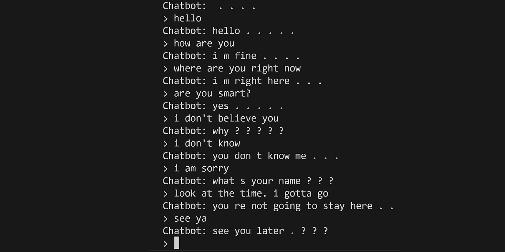

# Chatbot

A text-based AI that attempts to simulate human conversation.

## Requirements

Download the dataset from http://zissou.infosci.cornell.edu/convokit/datasets/movie-corpus/movie-corpus.zip

To install requirements, run the following commands:

- `pip install -r requirements.txt`
- `pip install torch`

If GPU is [CUDA-enabled](https://developer.nvidia.com/cuda-gpus), run the following command:

- `pip install torch --index-url https://download.pytorch.org/whl/cu118`

## Usage

Extract the dataset.

To run the program, run the following command:

`python main.py`
